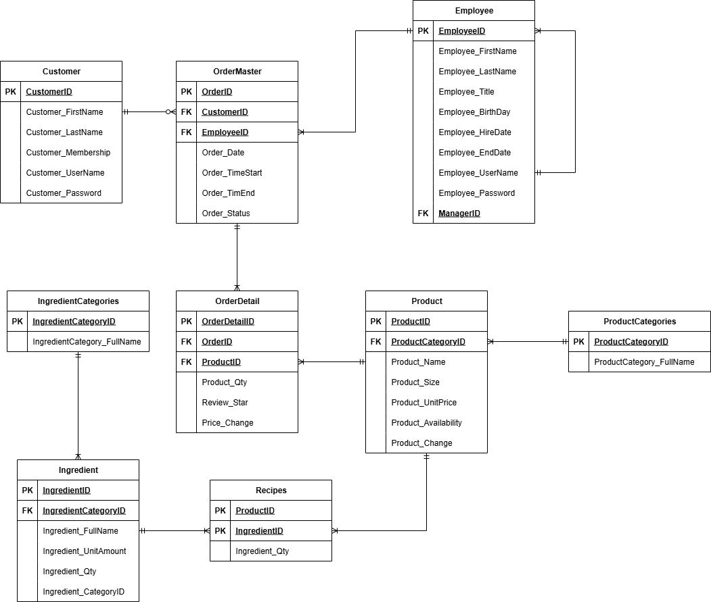

# 🟤 Bubble-Store: Machine Learning Application for Small Businesses

## 1. Background & Overview
In today’s competitive retail landscape, small businesses struggle with **resource allocation, demand forecasting, and customer retention**. This project demonstrates how **machine learning (ML)** can enhance decision-making and operational efficiency.

**Key objectives**
- 📈 **Forecast sales** to optimize inventory and reduce costs.  
- 🎯 **Personalize recommendations** to improve customer satisfaction and loyalty.  
- 🛠 **Support managers, employees, and customers** through a user-friendly desktop application.

This project simulates a **beverage store (2022–2024)**, integrating advanced ML models into a **role-based PyQt6 application**.

---

## 2. Data Structure
The project uses a simulated retail database designed for end-to-end ML workflows:

- **OrderMasters** – High-level order details (customer, employee, date, status).  
- **OrderDetails** – Itemized purchases, quantities, discounts, ratings.  
- **Products & ProductCategories** – Catalog with product info, pricing, and grouping.  
- **Recipes & Ingredients & IngredientCategories** – Maps products to ingredients and groups.  
- **Employees** – Staff profiles and roles.  
- **Customers** – Customer IDs and profiles.

---

## 3. Tech Stack
- **Language**: Python 3.11  
- **Data Analysis**: Pandas, NumPy  
- **Forecasting Models**: ARIMA, SARIMA, Exponential Smoothing (Statsmodels), Random Forest (Scikit-learn), XGBoost  
- **Recommender Systems**: Surprise (KNN, SVD), Scikit-learn (TF-IDF, cosine similarity)  
- **Visualization**: Matplotlib, Seaborn  
- **GUI**: PyQt6, Qt Designer  
- **Development Tools**: Google Colab, PyCharm, VS Code

---

## 4. Key Findings
- **Sales Seasonality**: Coffee consistently leads sales, peaking during holiday periods (New Year, July).  
- **Customer Behavior**: Loyal customers average >4.5 stars; occasional buyers are more critical.  
- **Employee Productivity**: 8 employees handled a disproportionate share of orders → imbalance.  
- **Sales Growth**: Steady upward trend with seasonal fluctuations.  
- **Model Performance**:  
  - **SARIMA** → best for seasonal forecasting.  
  - **SVD (collaborative filtering)** → most accurate & efficient recommender model.

⚠️ Without proper forecasting the business risks **overstocking** (wasted capital) or **stockouts** (lost sales & trust).

---

## 5. Insights
- ☕ **Product ranking**: Coffee > Frappuccino > Latte; seasonal drinks show short-term spikes.  
- 🎉 **Promotions**: December campaigns nearly doubled average sales.  
- 👥 **Customer segmentation**: High-frequency customers drive most revenue.  
- 👩‍💼 **Staffing**: Uneven workloads suggest better scheduling required.  
- ⭐ **Ratings**: Low scores often correlate with long wait times or stockouts.

---

## 6. Recommendations
1. **Inventory & Supply Chain**
   - Use SARIMA forecasts to stock peak-demand items.  
   - Phase out slow-moving SKUs.

2. **Customer Retention**
   - Implement loyalty programs.  
   - Use recommender outputs to upsell complementary products.

3. **Employee Management**
   - Rebalance shifts according to forecasted demand.  
   - Provide targeted training for underperforming staff.

4. **Marketing**
   - Schedule promotions ahead of seasonal peaks.  
   - Act on review patterns to improve service.

---

## 7. Machine Learning Solution
- **Forecasting**: ARIMA, SARIMA, Exponential Smoothing, Random Forest, XGBoost — **SARIMA chosen**.  
- **Recommender Systems**:  
  - Content-based: TF-IDF + cosine similarity.  
  - Collaborative: SVD (preferred) and KNN.  
  - Hybrid: Merge content + collaborative results to mitigate cold-start.  
- **Evaluation Metrics**: RMSE, MAE, MAPE (forecasting); RMSE, MAE (recommendation).  
- **Deployment**: Desktop GUI (PyQt6) with role-based access:
  - **Customer**: browse, order, history, recommendations.  
  - **Employee**: manage orders, customers, products.  
  - **Manager**: visualizations, train models, forecast.

---

## 8. Repository Structure
